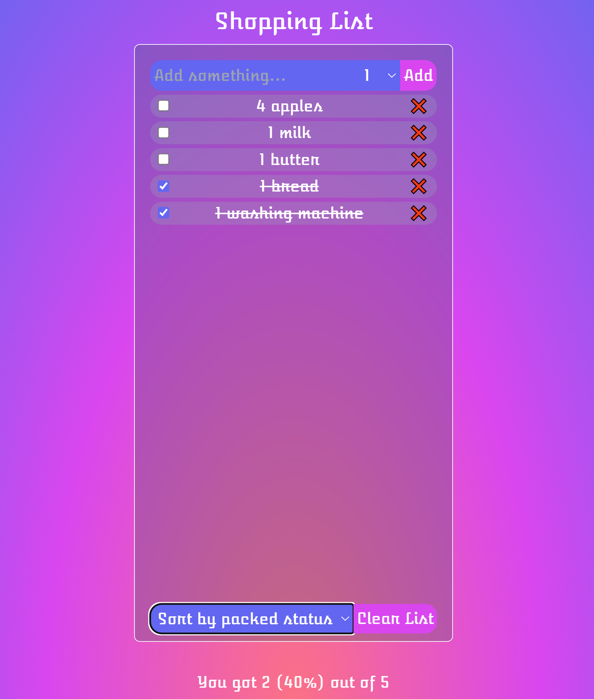

# React Shopping List



## Description

A simple shopping list built with Vite + React and TailwindCSS.
This was one of the first projects I did on the course 'The Ultimate React Course 2024: React, Next.js, Redux & More' by Jonas Schmedtmann. I tried to built this project on my own, a few months after I did it in the course. I added my own styles, additionally I used Vite, TailwindCSS, and added a local storage:

```jsx
function App() {
  const [items, setItems] = useState(() => {
    const savedItems = localStorage.getItem("shoppingList");
    return savedItems ? JSON.parse(savedItems) : [];
  });

  useEffect(() => {
    localStorage.setItem("shoppingList", JSON.stringify(items));
  }, [items]);
```
